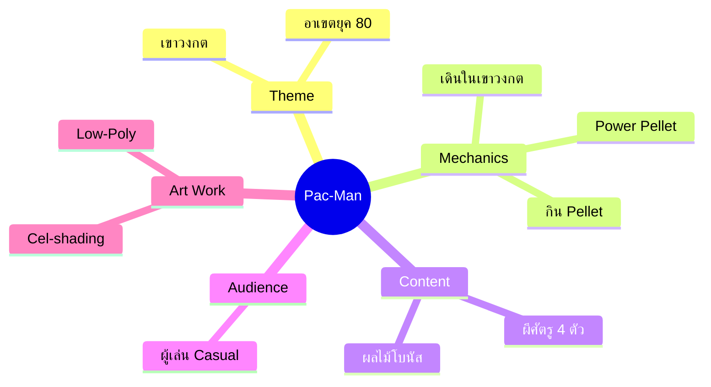
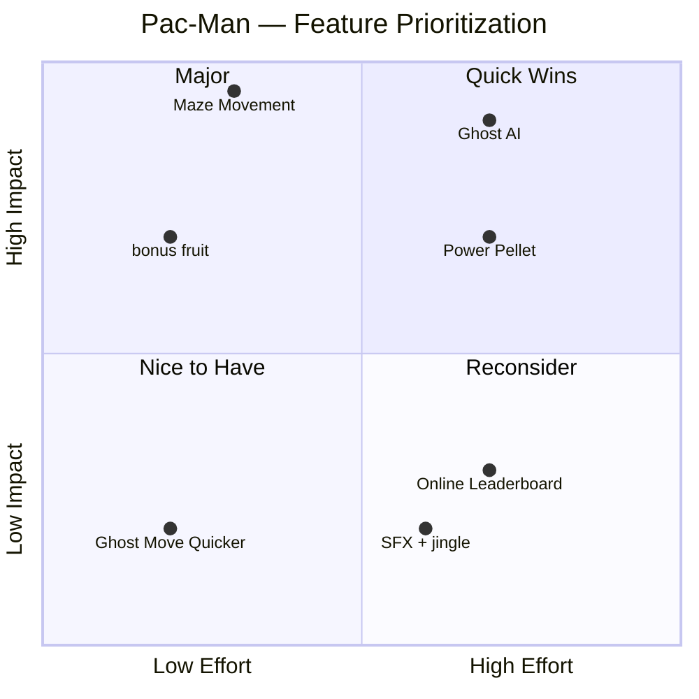
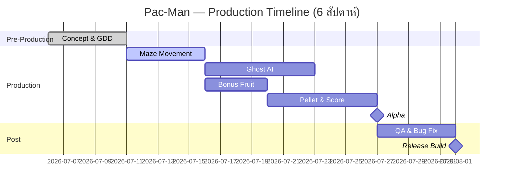

```mermaid
mindmap
	root((Pac-Man))
		Theme
			เขาวงกต
			อาเขตยุค 80
		Mechanics
			เดินในเขาวงกต
			กิน Pellet
			Power Pellet
		Content
			ผีศัตรู 4 ตัว
			ผลไม้โบนัส
		Audience
			ผู้เล่น Casual
		Art Work
			Cel-shading
			Low-Poly
```

```mermaid
quadrantChart
title Pac-Man — Feature Prioritization
	x-axis Low Effort --> High Effort
	y-axis Low Impact --> High Impact
	quadrant-1 Quick Wins
	quadrant-2 Major
	quadrant-3 Nice to Have
	quadrant-4 Reconsider
	Maze Movement: [0.3, 0.95]
	Ghost AI: [0.7, 0.9]
	Online Leaderboard: [0.7, 0.3]
	bonus fruit: [0.2, 0.7]
	Power Pellet: [0.7, 0.7]
	SFX + jingle: [0.6, 0.2]
	Ghost Move Quicker: [0.2, 0.2]
```

```mermaid
gantt
	title Pac-Man — Production Timeline (6 สัปดาห์)
	dateFormat YYYY-MM-DD
	section Pre-Production
	Concept & GDD :done, c1, 2026-07-06, 5d
	section Production
	Maze Movement :active, p1, after c1, 5d
	Ghost AI : p2, after p1, 7d
	Bonus Fruit : p2, after p1, 4d
	Pellet & Score : p3, after p2, 7d
	Alpha :milestone, m1, after p3, 0d
	section Post
	QA & Bug Fix : q1, after p3, 5d
	Release Build :milestone, m1, after q1, 0d
```
